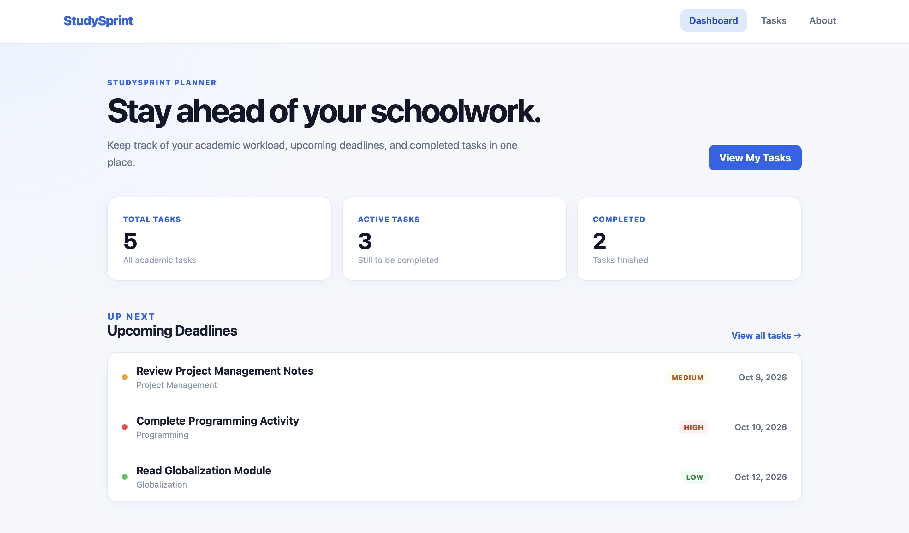

# StudySprint Planner

A lightweight academic task planner that helps students organize assignments, deadlines, subjects, and priorities in one place. It is designed for students who want a simple and organized way to keep track of their academic workload.

**Live site:** https://merwwki.github.io/StudySprint-Planner/  
**API:** https://studysprint-api-5bsr.onrender.com/healthz  
**Demo video:** (link)



## What it does

- Add academic tasks with a title, subject, description, due date, and priority
- View and organize saved tasks
- Edit existing tasks
- Filter tasks by all, active, or completed
- Mark tasks as completed and reopen completed tasks
- Delete tasks with a confirmation message
- View task information and upcoming deadlines through the dashboard
- Store task information in a PostgreSQL database

## 1. Overview

StudySprint Planner is a web-based task management application designed for students. It allows users to create and organize academic tasks by providing information such as the task title, subject, description, due date, and priority.

The application includes multiple pages for easier navigation. The Dashboard provides an overview of academic tasks, the Tasks page provides the main task-management functions, and the About page provides information about the application and its developer.

StudySprint Planner implements CRUD functionality. Users can create new tasks, read or view existing tasks, update tasks by editing their information or changing their completion status, and delete tasks when they are no longer needed.

Unlike the initial version of the project, the completed application uses a real Express API and PostgreSQL database. The frontend communicates with the deployed backend, while task data is stored in a Neon PostgreSQL database.

## Built with

StudySprint Planner uses React and Vite for the frontend, Express.js and Node.js for the backend, and PostgreSQL for data storage.

The completed application is deployed using:

- **Frontend:** GitHub Pages
- **Backend API:** Render
- **Database:** Neon PostgreSQL

React Router is used for navigation between the Dashboard, Tasks, and About pages.

## 2. Setup and installation

Before running the complete application locally, make sure the following are installed:

- Node.js
- npm
- PostgreSQL

Clone or download the StudySprint Planner repository and open the project directory.

The project contains separate `client` and `server` directories for the frontend and backend.

## Demo mode

StudySprint Planner supports both a mock API and a real API through an environment variable.

The mock API was used during the earlier development stage so that the frontend could be developed before the backend and PostgreSQL database were fully connected.

| `VITE_USE_MOCK_API` | What happens |
| --- | --- |
| unset, or `true` | The client uses the mock API and stores task information in the browser using `localStorage`. |
| `false` | The client communicates with the Express API, which reads and writes task information in PostgreSQL. |

The **final deployed version of StudySprint Planner uses the real API** rather than demo mode.

The frontend is hosted through GitHub Pages. Since GitHub Pages only hosts static content, the Express backend is hosted separately through Render and the PostgreSQL database is hosted through Neon.

| Piece | Service used |
| --- | --- |
| **Frontend** | GitHub Pages |
| **API** | Render |
| **Database** | Neon PostgreSQL |

Demo mode remains available in the project as a development and fallback option.

## Running it yourself

**The client only, in demo mode.**

No PostgreSQL database or Express server is required when using the mock API.

```bash
cd client
npm install
cp .env.example .env
npm run dev
```

Keep:

```env
VITE_USE_MOCK_API=true
```

Vite will display the local development address in the terminal.

**The whole stack.**

The complete version requires PostgreSQL and the Express API.

First, configure the backend:

```bash
cd server
npm install
cp .env.example .env
```

Update `server/.env` with the required PostgreSQL connection information.

Run the database schema:

```bash
npm run db:schema
```

If sample task data is needed, run:

```bash
npm run db:seed
```

Start the backend:

```bash
npm run dev
```

The development API normally runs at:

```text
http://localhost:3000
```

In another terminal, configure the frontend:

```bash
cd client
npm install
cp .env.example .env
```

Set the client to use the real API:

```env
VITE_USE_MOCK_API=false
VITE_API_BASE_URL=http://localhost:3000
```

Then start the frontend:

```bash
npm run dev
```

Check the API independently using:

```bash
curl http://localhost:3000/healthz
curl http://localhost:3000/readyz
curl http://localhost:3000/api/tasks
```

The `/healthz` endpoint checks whether the Express server is running, while `/readyz` checks whether the server can communicate with the PostgreSQL database.

## Environment variables

Environment variables containing actual credentials are not committed to the repository. `.env.example` files are provided as templates.

| Name | Where | What it is |
| --- | --- | --- |
| `DATABASE_URL` | server | PostgreSQL connection string used by the Express backend |
| `CORS_ORIGINS` | server | Origins allowed to communicate with the API |
| `NODE_ENV` | server | Application environment, such as `production` |
| `PORT` | server | Server port; the production host can provide this automatically |
| `VITE_USE_MOCK_API` | client, at build time | Determines whether the client uses the mock API or real API |
| `VITE_API_BASE_URL` | client, at build time | Public URL of the Express API |

The real `.env` files are excluded from Git using `.gitignore`.

Values beginning with `VITE_` are compiled into the frontend and are therefore public. Passwords, database connection strings, and other private credentials must never be placed in a `VITE_` environment variable.

## Deploying

**Client, to GitHub Pages.**

The React/Vite frontend is deployed through GitHub Pages using the project's GitHub Actions workflow.

The production frontend is available at:

```text
https://merwwki.github.io/StudySprint-Planner/
```

The deployed client is configured with:

```env
VITE_USE_MOCK_API=false
```

and uses the public Render API as its `VITE_API_BASE_URL`.

The application uses hash-based routing to support navigation on GitHub Pages. This allows pages such as Tasks and About to continue working when the browser is refreshed.

Example routes include:

```text
#/tasks
#/about
```

**API and database.**

The Express API is deployed as a Render Web Service.

The production API is available at:

```text
https://studysprint-api-5bsr.onrender.com
```

The production PostgreSQL database is hosted through Neon.

The Render service contains the production `DATABASE_URL`, `CORS_ORIGINS`, and other required server environment variables. The database credentials are not stored in the repository or frontend.

The frontend sends HTTPS requests to the Render API, and the Render API communicates with Neon PostgreSQL.

## Project structure

```text
StudySprint-Planner/
│
├── client/
│   ├── src/
│   │   ├── api/
│   │   ├── components/
│   │   ├── pages/
│   │   ├── App.jsx
│   │   ├── main.jsx
│   │   └── styles.css
│   ├── .env.example
│   ├── index.html
│   ├── package.json
│   └── vite.config.js
│
├── server/
│   ├── db/
│   ├── .env.example
│   ├── server.js
│   ├── tasksRepo.js
│   └── package.json
│
├── docs/
├── journal/
├── project/
├── AI-USAGE.md
├── compose.yml
├── LICENSE
├── README.md
├── security-checklist.md
└── START-HERE.md
```

The `client/` directory contains the React frontend.

The `server/` directory contains the Express backend and PostgreSQL-related files.

The `docs/` directory contains the project planning and documentation files.

The `journal/` directory contains weekly reflection journals.

The `project/` directory contains project increment reports.

## Architecture

StudySprint Planner uses a frontend, backend, and database architecture.

```text
Student
   |
   v
React + Vite Frontend
GitHub Pages
   |
   | HTTPS requests
   v
Express API
Render
   |
   | PostgreSQL connection
   v
PostgreSQL Database
Neon
```

The React frontend handles the user interface and sends requests to the Express API.

The Express API handles operations involving task data. It communicates with PostgreSQL to create, retrieve, update, and delete tasks.

The browser does not communicate directly with PostgreSQL. Database credentials remain on the server side.

The main task operations are:

| CRUD Operation | StudySprint Function |
| --- | --- |
| Create | Add Task |
| Read | View Tasks |
| Update | Edit Task, Complete Task, Reopen Task |
| Delete | Delete Task |

The application is currently designed as a single-user student planner and does not include authentication or individual user accounts.

## What I would do next

- Add user accounts and authentication so multiple students can have separate task lists.
- Add search functionality for task titles and subjects.
- Add additional filtering by subject or priority.
- Add a calendar view for academic deadlines.
- Add deadline reminders and notifications.
- Add recurring tasks for weekly academic activities.
- Add additional dashboard statistics and progress information.
- Add file attachments for assignments and academic resources.

## Author

## Author

Developed as a final project for 6APSI.
Course and Section: Computer Science | CS - 401

## AI use

I used AI tools while developing StudySprint Planner. Full disclosure of AI assistance is available in `AI-USAGE.md`.

AI assistants used:

- ChatGPT
- Google Gemini

AI assistance was used for development guidance, troubleshooting, code explanation, debugging support, and documentation assistance.

[AI-USAGE.md](AI-USAGE.md)


## Licence

MIT, see [LICENSE](LICENSE).